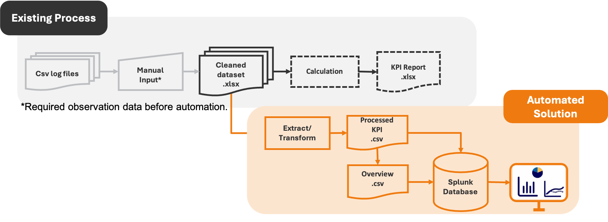

# Robotics KPI Dashboard Automation

## Overview
Developed an automated KPI reporting solution for a baggage handling robotics system during my internship.

The project replaced a manual Excel-based reporting process with a Python ETL pipeline that processes operational log files, calculates KPIs, and developes dashboards for monitoring system performance.

## Business Problem
The engineering team relied on manual Excel reporting to track operational KPIs.

This process was time-consuming and difficult to maintain as data volume increased.

The objective of this project was to automate KPI generation and provide a more efficient monitoring solution.

## Solution
Designed and implemented an end-to-end KPI reporting workflow that:

- Processes operational log files automatically
- Cleans and transforms raw data
- Calculates operational KPIs
- Generates KPI reports
- Supports dashboard visualization in Splunk and Power BI

## Tools Used
Python (Pandas, Numpy)
Splunk
Power BI
Excel

## Results
1. Reduced manual reporting effort by approximately 90%
2. Improved KPI reporting speed and consistency
3. Enabled faster operational monitoring
4. Supported data-driven decision making for the engineering team

